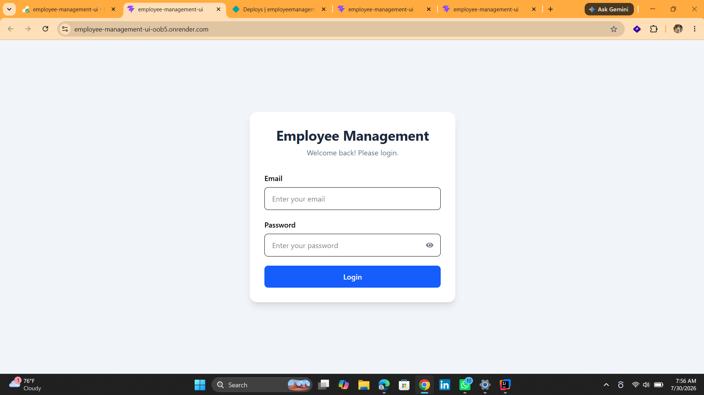
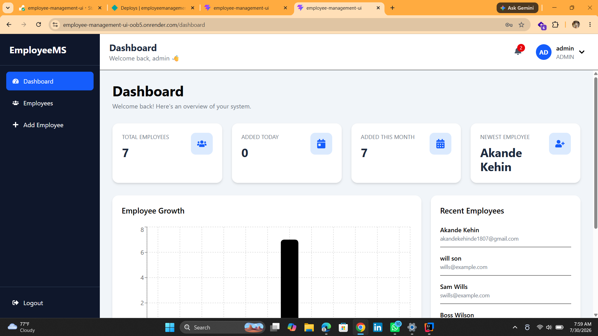
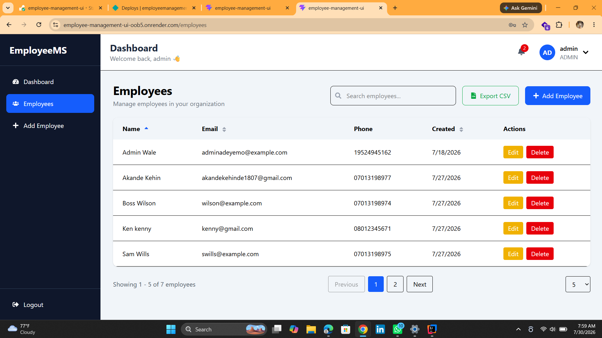
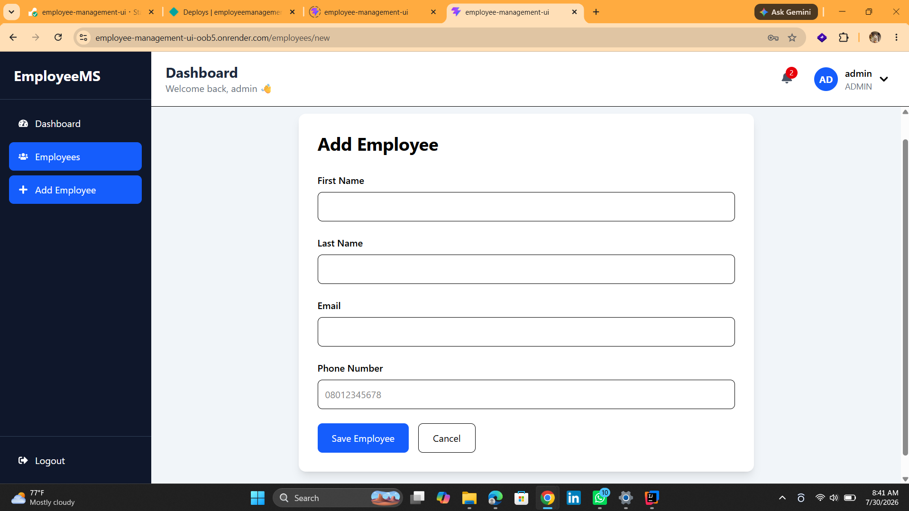
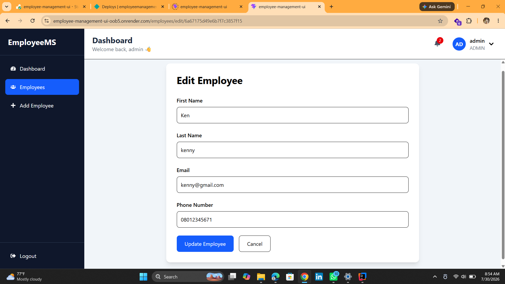

# Employee Management Platform API

A production-ready REST API powering the **Employee Management Platform**.

Built with **Spring Boot 3**, **MongoDB Atlas**, **Spring Security**, and **JWT Authentication**, the API provides secure employee management through role-based access control (RBAC).

---

# 🌐 Live Application

### Frontend

https://employee-management-ui-oob5.onrender.com/

### Backend API

https://employee-api-6lau.onrender.com/

### Swagger Documentation

https://employee-api-6lau.onrender.com/swagger-ui/index.html

---

# 📌 Overview

The Employee Management Platform enables organizations to securely manage employees through a modern web application.

Administrators can:

- Create employees
- View employees
- Update employee records
- Delete employees
- Search employees
- Sort employees
- View paginated employee lists

Employees can:

- Login securely
- View their profile
- Update their profile
- Change their password

This project demonstrates modern backend architecture, REST API development, JWT authentication, role-based authorization, cloud deployment, Docker, and production-ready software engineering practices.

---

# 🚀 Features

- JWT Authentication
- Role-Based Access Control (ADMIN & EMPLOYEE)
- Employee CRUD Operations
- Employee Search
- Employee Sorting
- Employee Pagination
- Profile Management
- Change Password
- Swagger/OpenAPI Documentation
- MongoDB Atlas Integration
- Docker Support
- GitHub Actions CI/CD
- Global Exception Handling
- Input Validation

---

# 🛠 Tech Stack

- Java 21
- Spring Boot 3
- Spring Security
- JWT
- MongoDB Atlas
- Maven
- Docker
- Swagger/OpenAPI
- GitHub Actions

---

# 📂 Project Structure

```text
src
├── advice
├── config
├── controller
├── dto
├── enums
├── exception
├── mapper
├── model
├── repository
├── security
├── service
└── util
```

---

# 🔐 Authentication

The API uses JWT Authentication.

Public endpoints

```
POST /api/auth/register
POST /api/auth/login
```

Protected endpoints require

```
Authorization: Bearer <JWT_TOKEN>
```

---

# 📚 API Documentation

Swagger UI

```
https://employee-api-6lau.onrender.com/swagger-ui/index.html
```

Local

```
http://localhost:8080/swagger-ui/index.html
```

---

# 🐳 Running with Docker

Clone the repository

```bash
git clone https://github.com/Longlasting1805/employee-api.git
```

Navigate into the project

```bash
cd employee-api
```

Run

```bash
docker compose up --build
```

---

# ⚙️ Environment Variables

Create a `.env` file.

Required variables

```env
MONGODB_URI=
JWT_SECRET=
JWT_EXPIRATION=86400000
```

---

# 🧪 Running Tests

```bash
./mvnw test
```

or

```bash
mvn test
```

---

# 🚀 Deployment

Frontend

https://employee-management-ui-oob5.onrender.com/

Backend

https://employee-api-6lau.onrender.com/

Database

MongoDB Atlas

---

# 🔄 CI/CD

GitHub Actions automatically

- Builds the project
- Runs tests
- Verifies every push
- Verifies every pull request

---

# 📸 Screenshots

## Login



---

## Dashboard



---

## Employee List



---

## Create Employee



---

## Edit Employee



---

## Profile


---

## Change Password


---

# 🔮 Future Improvements

- Email Notifications
- File Upload Support
- Audit Logs
- Activity History
- Employee Avatar Upload
- Department Management
- Role Management
- Analytics Dashboard
- Export Employees to Excel/PDF

---

# 🤝 Frontend Repository

The frontend for this project is available here:

https://github.com/Longlasting1805/employee-management-ui

---

# 👨‍💻 Author

**Akande Kehinde**

Software Engineer

Java • Spring Boot • React • MongoDB • Docker • JWT • REST APIs